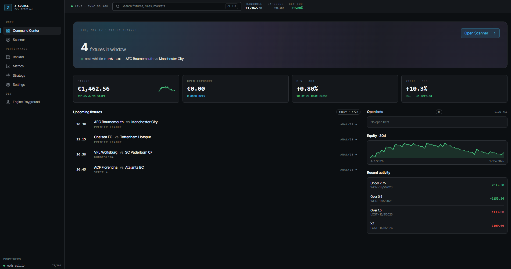
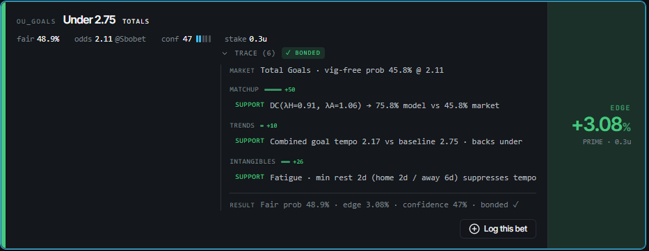
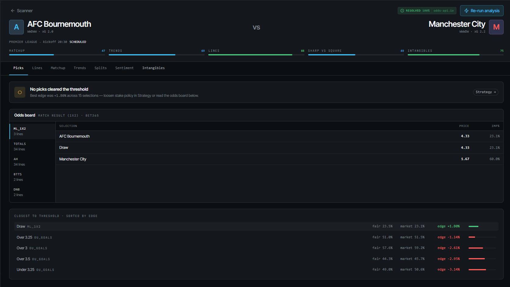
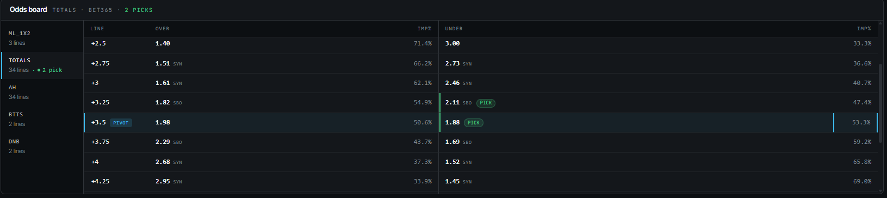
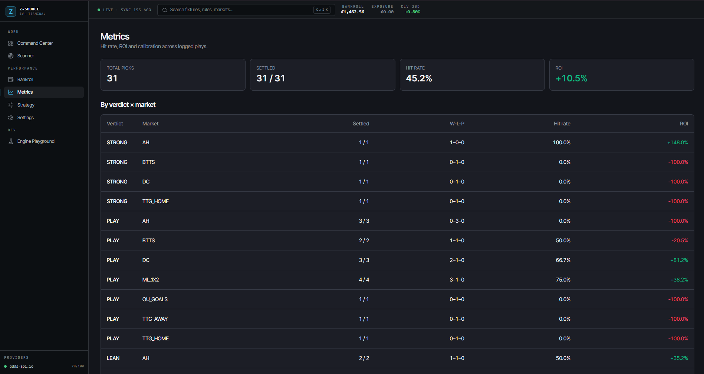
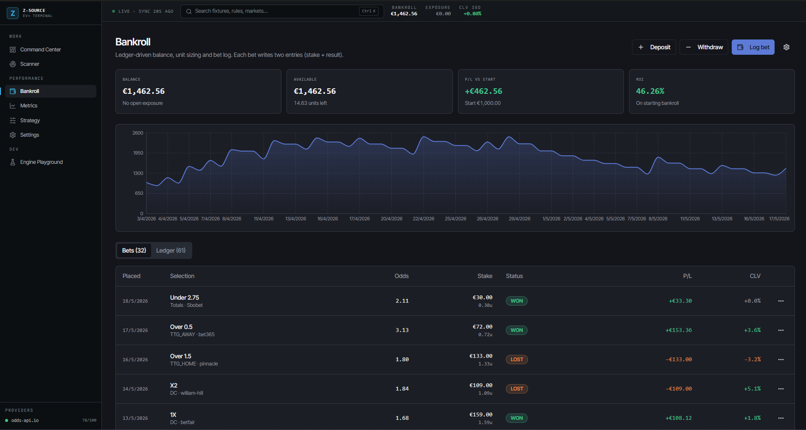
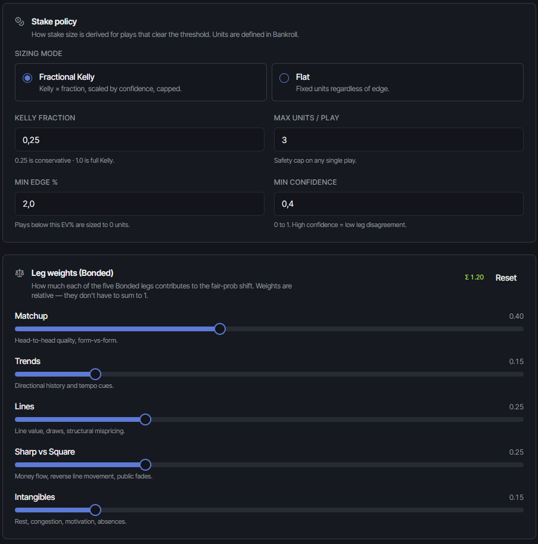
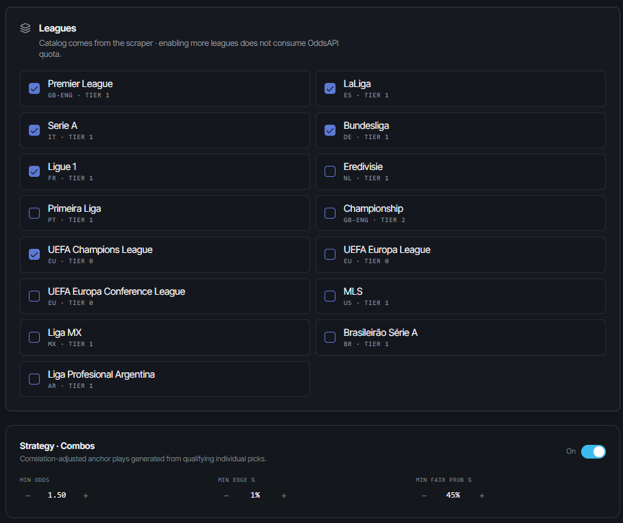

# Z-Source

Z-Source is an EV+ (Positive Expected Value) sports betting analytics desktop application. It identifies high-value plays by combining the proprietary **Bonded Betting Methodology** — a five-pillar evaluation across Matchup, Trends, Lines, Sharp vs. Square, and Intangibles — with a pluggable rule registry and fractional Kelly stake sizing.

The system runs locally as a Tauri 2 desktop app, aggregating odds from multiple providers, scraping public market splits and historical match data, modelling missing alt-lines via Dixon-Coles, and tracking every recommendation through a deterministic reasoning trace.



---

## Key Capabilities

### Bonded Analysis Engine
The pipeline scores each candidate across five legs and combines them through a signed, capped consolidator that gates verdicts (`PASS` / `LEAN` / `PLAY` / `STRONG`) on bonded coverage (≥3 positive legs, no leg below −0.4 for `PLAY`+).

* **Pluggable rule registry** — 15 active rules: `vigAdjustedEdge`, `drawValueAt375`, `lineMovementVsPublic`, `sharpSquareDetector` (unified 5-pattern detector: RLM, DOG_TRAP, DIVERGENCE, HEAVY_NO_DIV, PURE_FADE), `favFullMatchToFirstHalf`, `cornersHighTempo`, `xPointsRegression`, `xGMatchupAsymmetry`, `bttsXgPoisson`, `goalsTempoForm`, `doubleChanceDcModel`, `teamTotalsXgDc`, `formDivergence`, `h2hDominance`, `restCongestion`.
* **Reasoning trace** — every recommendation emits a per-leg trace with rule-fired flags, pattern tags, data-missing markers, single-book pricing warnings, and bonded badge.
* **Composite ranking** — picks sort by `edge × confidence`; bonded caps prevent any single signal from dominating.



**Diagnostics + Near-Misses** — empty-state cards surface why no plays fired (rules skipped, data gaps) and the top-3 PASS candidates ranked by `edge × confidence` for inspection.



### Synthetic Alt-Lines (Dixon-Coles)
When the book offers fewer lines than the engine wants to evaluate, Z-Source generates them itself.

* **Power + Dixon-Coles** matrix from team xG produces fair probabilities for Over/Under and Asian Handicap alt-lines.
* Synthetic offers enter the pipeline marked `book="synthetic-poisson"`; `vigAdjustedEdge` short-circuits to zero on them so signal comes from xG-based rules instead of phantom vig edges.
* Noise thresholds (1.65% OU, 5.17% AH) prevent low-confidence synthetic lines from flooding the candidate list.



### Markets Supported
* **Mains:** 1X2, Draw No Bet, Asian Handicap, Totals (O/U Goals), BTTS, 1H Match Result, Double Chance, Team Total Goals (home/away), BTTS halves (1H / 2H).
* **Secondaries:** Total Corners, Team Corners, Total Cards, Total Shots, Shots on Target, GK Saves, Tackles, Throw-ins.

### Combo Plays
* **Value combos** — two-leg combinations with hardcoded correlation matrix (extended for DC, TTG, BTTS halves).
* **Anchor combos** — boosts low-decimal legs (≤1.55, confidence ≥0.65, ρ ≥0.15) into the 1.60–2.20 sweet spot. UI distinguishes Value vs. Anchor sections per match.


### Multi-Provider Data Ingestion
Strict fallback chain, quota tracking, local cache.

* **Odds aggregation** — primary `odds-api.io` (100/h free tier; capped backfill: top 2 books × 3 markets × median line ≈ 6 req/match) with failover to `the-odds-api.com`. Single-book pricing mode filters offers to user-selected books and warns on phantom edges.
* **Catalog + history** — SofaScore for fixtures, recent forms, H2H, congestion, and `/event/{id}/statistics` for xG ingestion. Requires browser TLS fingerprint (`preferBrowserFetch: true`); native curl/node hits 403.
* **Action splits** — Action Network + SBR scraping for ticket/money percentages powering Sharp vs. Square detection.
* **Quota tracker** — per-provider usage persisted in SQLite; UI surfaces remaining budget.

### Telemetry & Calibration
* `/metrics` page reads from `pick_outcomes` (auto-mirrored from `useLogBet` / `useSettleBet`).
* KPI cards, summary table by `verdict × market`, and calibration scatter chart (recharts) plotting predicted probability vs. realised hit rate.



### Bankroll & Ledger
* **Equity curve & yield** — ROI, units won/lost, active exposure.
* **Closing Line Value** — captures final pre-kickoff odds for CLV-vs-bet analysis.
* **Fractional Kelly** stake sizing with confidence multipliers and bonded caps.
* **Portability** — full CSV / JSON import-export for ledger and strategies.



---

## Technical Architecture

Local-first Tauri 2 desktop binary; no remote backend.

* **Frontend:** React 18, TypeScript, TailwindCSS, shadcn/ui, TanStack Query (with sync-storage persistence), `cmdk` palette, recharts.
* **Backend glue:** Rust via Tauri 2 — `tauri-plugin-sql` (SQLite migrations), `tauri-plugin-store` (credentials), `tauri-plugin-http` (CORS-bypass for scraping).
* **Engine:** pure TypeScript. Rules are 1 file + 1 line in the registry; markets are one `MarketAdapter` each.
* **Validation:** Zod schemas on every provider response and engine output.
* **Testing:** Vitest + Testing Library + MSW + fast-check. Engine suite covers rules, markets, combine, pipeline, synthetic, and provider fallbacks.





---

## More Views

| View | Image |
| --- | --- |
| `cmdk` command palette | `docs/images/palette.png` |
| Scanner tab close-up | `docs/images/scanner.png` |

---

## Local Development

### Prerequisites
* Node.js 18+
* Rust toolchain (cargo, rustc)
* Tauri 2 system dependencies for your OS (see [tauri.app/start/prerequisites](https://tauri.app/start/prerequisites))

### Setup & Run

```bash
npm install
npm run tauri:dev      # full desktop app (Vite + Rust)
npm run dev            # web-only, for fast UI iteration
npm run test           # vitest suite
npm run tauri:build    # production binary
```

### Releases
Tagging `v*` (e.g. `v0.1.0`) triggers `.github/workflows/release.yml`, which builds installers for macOS (Apple Silicon + Intel), Linux, and Windows and drafts a GitHub release.

---

## Disclaimers

This software is provided for analytical and educational purposes. Sports betting is regulated differently in every jurisdiction; users are responsible for compliance with local laws. The engine surfaces statistical edges — it does not guarantee profit and offers no investment advice. All data, credentials, and ledger state remain on the user's machine.
