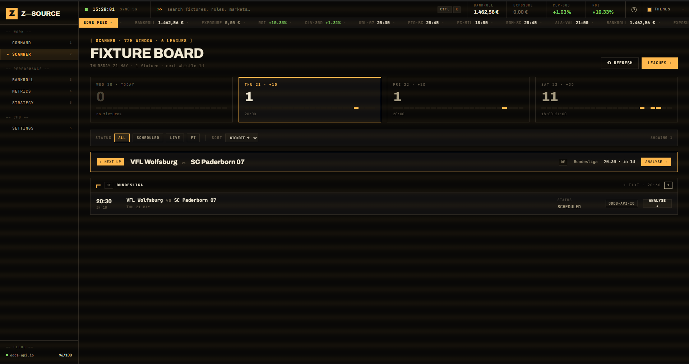
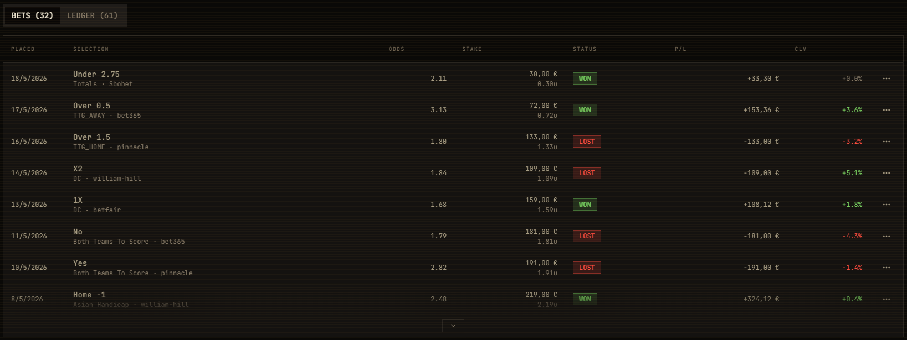
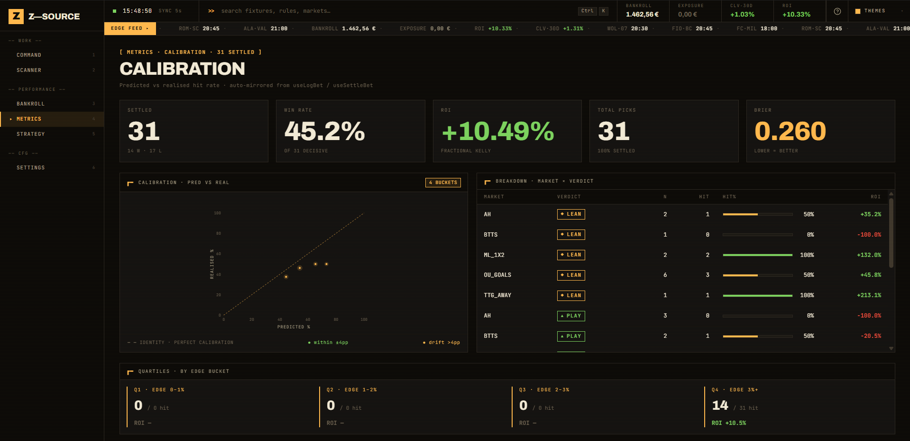
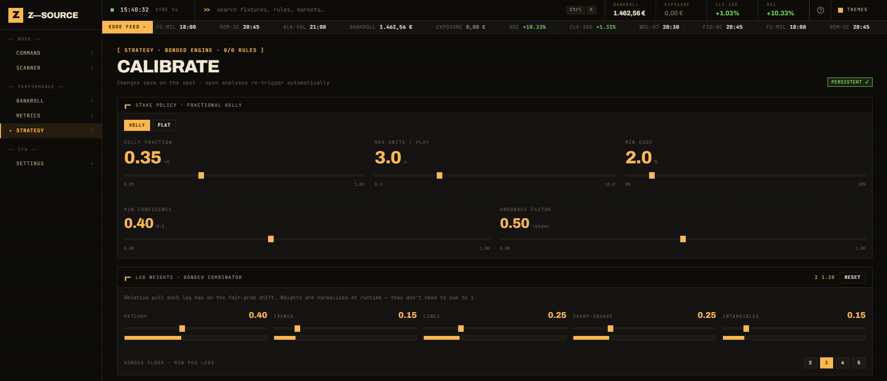
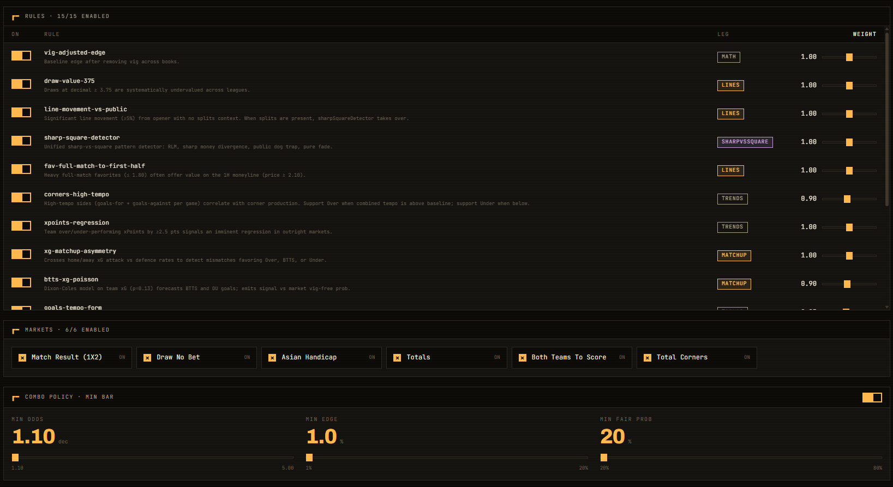
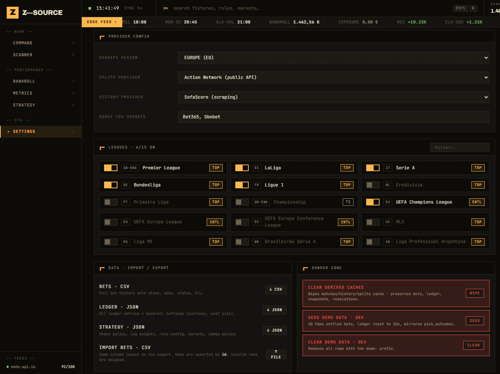

# Z-Source

> A desktop terminal for football betting strategy — scan fixtures, build picks, track bankroll, measure calibration.

Z-Source is a local-first desktop app that turns the messy parts of value betting into a clean, deterministic workflow. Pull a window of fixtures, run them through a configurable engine, place bets, and watch the math hold up (or not) over time.


---

## What it does

Z-Source is built around five places you spend time in:

```
  Scanner    ->   Match detail   ->   Bankroll
     |                |                  |
     +------> Strategy + Metrics <-------+
```

- **Scanner** — Browse fixtures by day and league. Filter by status, sort, flag interesting matches.
- **Match detail** — Drill into a single match. See market lines, engine output, and the full reasoning trace.
- **Strategy** — Tune the engine. Toggle markets, weight legs, edit rules, pick a stake policy, set combo behavior.
- **Bankroll** — Place bets, log adjustments, watch the equity curve build over time.
- **Metrics** — Hit rate, ROI, Brier score, calibration bins. The reality check on the strategy.

Everything is local. Data lives on your machine. No accounts, no cloud sync by default.

---

## Highlights

- **Bonded engine** — A pipeline of markets, rules, EV checks, stake sizing, and synthetic alt-lines. Outputs are traceable end to end.
- **Deterministic** — Same inputs, same picks. Useful for debugging and for trusting what you see.
- **Calibration-first** — The Metrics screen treats probability honesty as the goal, not just hit rate.
- **Keyboard-friendly** — Built like a terminal. Dense, fast, monospace where it matters.
- **Theming** — Pit-floor terminal look by default, with accent themes.


---

## Tech stack

| Layer    | Stack                                              |
|----------|----------------------------------------------------|
| Shell    | Tauri 2 (Rust)                                     |
| UI       | React 18 + TypeScript + Vite                       |
| Styling  | Tailwind CSS, Radix primitives, custom `zs` kit    |
| State    | TanStack Query with persistent cache               |
| Storage  | SQLite via `@tauri-apps/plugin-sql`                |
| Charts   | Recharts                                           |
| Tests    | Vitest, Testing Library, fast-check, MSW           |

---

## Getting started

Prerequisites: Node 20+, npm, and the Rust toolchain (only needed for the desktop build).

```bash
# install
npm install

# run the web version (fastest dev loop)
npm run dev

# run the full Tauri desktop shell
npm run tauri:dev

# build the desktop app
npm run tauri:build
```

The web version uses the same UI; the desktop version adds persistent SQLite storage and native windowing.

---

## Project layout

```
src/
  pages/        screens (Scanner, MatchDetail, Bankroll, Metrics, ...)
  features/     feature modules (one folder per page area)
  engine/       picks pipeline — markets, rules, EV, stake, combos
  domain/       core types (Match, Bet, Strategy, Trace, ...)
  storage/      repos + persistence layer
  components/   shared UI, including the `zs` design kit
src-tauri/      Rust side of the desktop app
```

If you want to read the code, start at `src/engine/pipeline.ts` — that file is the spine.

---

## Screens

### Scanner
The entry point. Days across the top, leagues grouped, matches inside. Filters and sort live on the right.



### Match detail
One match, expanded. Lines, picks, and the reasoning trace that produced them.


### Bankroll
Equity curve, open exposure, ledger, bet history. Adjustments and manual entries via dialogs.




### Metrics
Calibration bins, KPIs, the long-term truth about your edge.



### Strategy
Five cards — Markets, Leg weights, Rules, Stake policy, Combo policy.




### Settings
App-wide options: theme, accent, storage, fixtures window, and more.



---

## Status

Z-Source is a personal tool that escaped its drawer. Things move; APIs change; the strategy engine is opinionated. Treat it as a working sketch you can edit, not a finished product.

---

## License

See `LICENSE` if present, otherwise: all rights reserved by the author for now.
